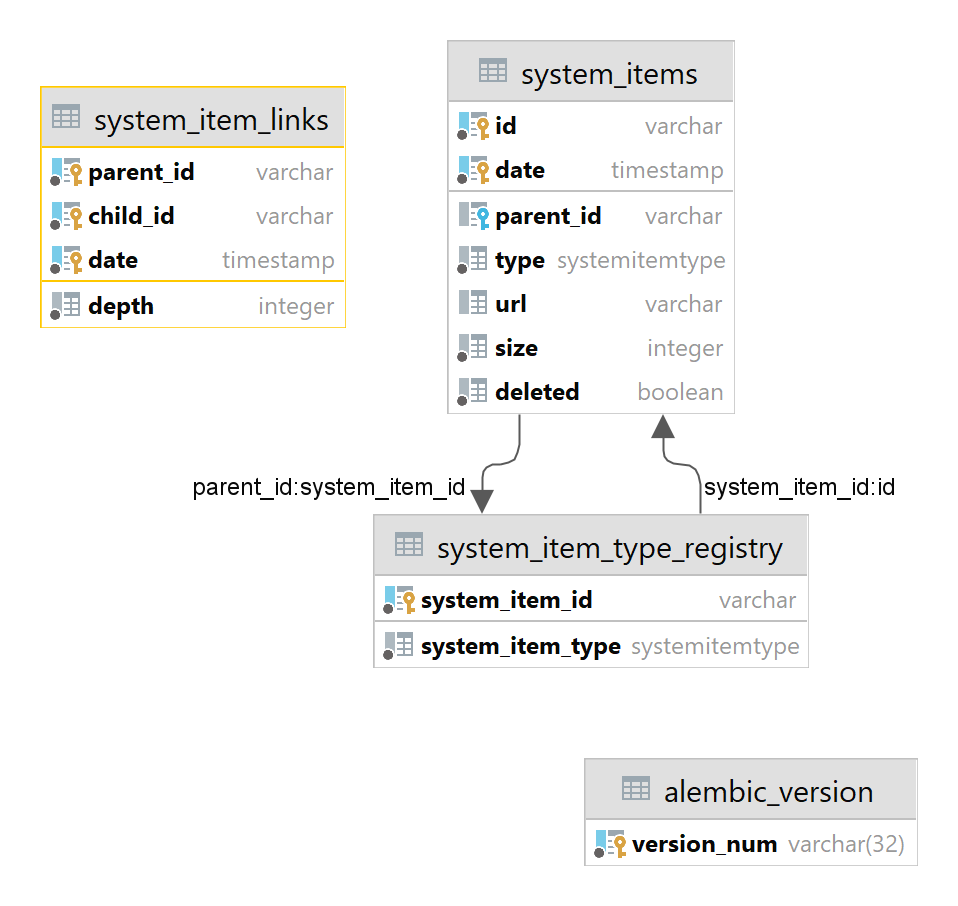

# Yadisk-API

## Описание

#### Технические особенности

Сервис написан на языке Python (версия 3.10), с использованием фреймворка FastAPI.  
В качестве БД выбрана PostgreSQL.  

#### Модель данных

Чтобы добиться полной заявленной функциональности, пришлось провести небольшое исследование на тему хранения древовидных структур. В итоге большинство статей указывали на следующие варианты:  
- Графовые БД
- Обычные таблицы с полем parent_id + рекурсивные запросы (PostgreSQL)
- Продвинутые паттерны хранения данных - Nested sets, Materialized path, Closure table

С графовыми БД я никогда не работал, так что их я не стал рассматривать (6 дней, из которых 4 рабочих, это очень мало для освоения принципиально новых технологий).  
Nested sets и Materialized path мне не понравились, так как было очевидно что будут сложности с перестроением графа.  
Рекурсивные запросы попробовал и понял, что меня ждет ад при построении историй изменений объектов =)  
В итоге остановился на паттерне Closure table, к которому прикрутил еще одно измерение - время добавления элементов.  

Подробнее про паттерн можно почитать [здесь](https://habr.com/ru/post/537062/).  

Вот так выглядит модель данных:  

[]()

таблица system_item_type_registry - вспомогательная, данные туда записывываются непосредственно перед добавлением объектов system_items. Она работает как guard для system_items.id (при попытке обновить запись с другим типом - срабатывает триггер, который не дает этого сделать), а также не дает вставлять в system_items записи с несуществующими parent_id.  

## Запуск сервиса

#### Разработка

В режиме разработки достаточно предварительно поднять контейнер с базой, выполнив команду:
```shell
docker-compose -f docker-compose-dev.yml up -d
```
Рабочая директория - корневая, точка входа: `./src/yadisk_api/__main__.py`.  
Ожидается, что строка подключения к БД будет указана в переменных среды (database_url=...) или сохранена в файле .dev.env в корне проекта.  

#### Развертывание

Сервис запушен на hub.docker.com в качестве готового контейнера: **snowborodist/yadisk-api:1.0.2**

Все, что нужно сделать, это скопировать на машину с заранее установленным докером файл ./deploy/docker-compose.yml и выполнить в одной директории с ним команду:

```shell
sudo docker-compose up -d
```  

Будет запущен следующий набор контейнеров:
- **postgres** - контейнер с базой данных сервиса.
- **yadisk-api** - непосредственно контейнер сервиса.

Контейнеры настроены таким образом, чтобы обеспечить постоянное хранение данных (используется docker volume) и автоматический перезапуск сервисов (restart: always).


## Документация
- Автоматически сгенерированная документация [доступна здесь](https://conversion-1980.usr.yandex-academy.ru/docs).  
- В коде проекта есть docstrings с описанием функций репозитория и некоторых сервисов.  Код можно посмотреть на [гитхабе](https://github.com/snowborodist/yadisk-api) или на сервере в папке /code.  
- При возникновении любых вопросов я всегда готов на них ответить в Telegram: [@snowborodist](https://t.me/snowborodist).  